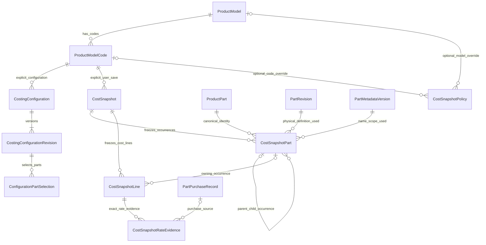

# Live costing and immutable snapshots — owner decisions, 7 October 2026

Status: accepted requirements implemented in application code and Safari Grist schema v9 on 8 October 2026. This supersedes the old cost-run-based remedy for finding 4 in `PARTS_COMPLETION_REVIEW_2026_10_07.md`; the other four reviewed defects were also corrected.

## Behavior

**Live Cost** is a disposable calculation for one Product Model Code. Opening/selecting/refreshing a code resolves its current valid configuration, quantities, applicable engineering definitions, component relationships, current Part metadata and current eligible material, purchased-Part and process rates. It writes no costing history, snapshots or rate evidence. A later rate or configuration change can change the next live result.

Live costing must use explicit configuration data. A file association, reviewed source mapping, shared workbook baseline or broad Part scope is not a Model Code BOM. Missing configuration or rate evidence is shown as incomplete/unavailable, not fabricated and not zero. The existing MaterialRateLog latest-entered/default rule remains intact. Purchased rates come from the newest eligible actual purchase across reviewed vendors. Process rates require their own valid source/policy; do not invent rates for unimplemented domains.

**Save Cost Snapshot** is an explicit user action. It freezes the reviewed calculation as immutable, normalized Grist records. Merely viewing a Model Code, viewing purchase rates, recording a purchase, editing metadata or passing a reminder date cannot create snapshots. Save Snapshot Now is available regardless of reminder frequency; a save still validates completeness and consistency rather than presenting incomplete inputs as a fully priced result.

**Open Snapshot** reads frozen rows and evidence only. It does not resolve current rates/configuration. The illustrative 1 October total of INR 191,840 remains unchanged when the 7 October live cost becomes INR 193,020. These numbers are examples, not production evidence.

Snapshots are not large JSON documents or collections of copied master records. Canonical references identify inputs; frozen scalar facts and version/evidence links preserve the values required for historical understanding. Do not use live Grist formulas referencing mutable masters to compute historical quantities/rates/names/totals.

## Grist entities and field responsibilities

The v9 live schema was inspected before applying this design. The tables below are implemented in `app/schema.py`; they reuse ProductPart, PartRevision, ProductModelCode, Material, LineMaster, Vendor and purchase records where appropriate. Workbook `CostingSnapshot` remains source evidence; `CostSnapshot` is the one canonical monetary history.

| Entity | Responsibility and key fields |
| --- | --- |
| `CostSnapshot` | UUID, Model Code reference, configuration/revision reference, captured-at and costing-as-of times, creator, label/notes, currency, cost basis, total, calculation-policy version, publication status, source/configuration manifest fingerprint, request key/fingerprint. |
| `CostSnapshotPart` | Snapshot, stable occurrence key, canonical Part and engineering revision, metadata version, frozen name/number, parent snapshot-Part reference, component/configuration-selection identity, quantity per parent, effective quantity, UOM and sourcing route. One row per occurrence, including a child reused at different assembly paths. |
| `CostSnapshotLine` | Snapshot and Part occurrence, stable occurrence/line key, canonical line/revision or component/purchased/adjustment identity, material/item/process reference, configuration override identity, frozen description, quantity/UOM, dimensional/time/weight basis, applied rate, gross/recovery/adjustment/net cost, cost category, policy and rounding basis. |
| `CostSnapshotRateEvidence` | Snapshot/line reference, source type, source record/version identity, effective/transaction date where applicable, frozen raw and normalized rate/UOM/currency, conversion reference and frozen factor, vendor/purchase reference, discounts/excluded charges and rate-selection policy. Multiple evidence rows where one line needs several inputs. |
| `CostSnapshotPolicy` | System default, optional Product Model override, optional Model Code override; Weekly/Monthly/Manual; timezone/anchor details, actor/reason/version audit. Exactly one relevant scope target; nearest explicit override wins. |
| Snapshot publication journal | Reuse a suitable durable request mechanism or introduce a small snapshot-specific one. Holds operation identity, fingerprint and publication progress; staged snapshot rows hold calculation facts. It must not become a giant JSON copy of the calculation. |

`CostingSnapshot` already represents source-workbook semantic/import evidence. It is distinct from `CostSnapshot`, which represents a saved monetary calculation. Retain the source entity and reference it where useful. Do not rename/delete existing source snapshots or lose their accepted line provenance.

`CostRun` / `CostBreakdownLine` in the broad conceptual diagram must be reconciled with the new names: reuse implementation responsibilities as the calculator/normalized snapshot header and lines, not a second independently authoritative history. An in-memory calculation may have a transient ID without a persisted run. Existing `PurchasedPartCostEvidence` is candidate typed purchase evidence owned by a snapshot line. Extend/migrate it or consolidate into the common rate-evidence entity, but do not maintain duplicate histories. Preserve any existing records with an explicit legacy classification; do not delete uncertain historical evidence.

Cross-document MaterialRateLog evidence cannot be a Grist Ref to a table in another document. Store source document/table/record identity, source version/date evidence and frozen values, or reference a reviewed local canonical mirror. References to external mutable/deleted evidence alone do not reproduce a snapshot.

Material/process/line source links and policy's system-default row are detailed in the table specification rather than all drawn above. Line/purchase evidence links are optional according to the cost category. Components are structure; do not charge both an assembly's rolled-up subtotal and all its descendants again.

## Consistency and immutability

Calculation must record a transient manifest of exact configuration/Part/line/rate/version inputs and its policy version. Detect inputs changing during calculation and retry or show review-needed; do not quietly mix old quantities with a new configuration.

Save the reviewed live calculation using its generation/fingerprint. Recheck authoritative input versions before accepting it, and reject a stale preview clearly rather than silently substituting a different cost. After accepting the operation, freeze its normalized staging rows durably. Recovery with the same request key resumes those facts, even if current rates later change. Reusing the key with different inputs conflicts. Deliberately saving a new snapshot uses a new request key and snapshot identity, even when its total equals an earlier snapshot.

Grist multi-table publication needs explicit publishing/complete states and verified row counts/references/checksums. Publishing rows cannot appear as completed history or comparisons. A lost response after completion returns the same completed snapshot. Reject mutation of completed headers/parts/lines/evidence through application paths; establish the deployment/direct-edit governance boundary instead of claiming native unique/immutable constraints that the API does not supply.

Implementation: the service hides publishing rows, validates expected record counts/references and checks a checksum over all normalized Part, line and evidence fields on every historical detail read. Application APIs do not update completed snapshot facts. Grist itself does not provide a uniqueness/immutability guarantee against a user with direct table-write permission; the checksum detects edits and historical reads fail closed, while deployment permissions remain the administrative boundary.

Current Part/child names and scope reflect current metadata without reconfiguring assemblies or revising parents. Snapshot views retain the captured metadata version and frozen name. Metadata is separate from physical revision changes. Draft child physical definitions cannot silently change finalized parent engineering content; enforce that closure while allowing metadata and commercial rate changes. All managed engineering revisions remain A until the CR flow exists.

## Reminder policy

Resolve System default → Product Model override → Model Code override, with explicit Inherit versus Manual only. Weekly and monthly are reminder/due policies, not automatic generation. An explicit Manual override suppresses an inherited due policy. Define the schedule anchor, first-snapshot behavior, timezone and calendar-month boundary behavior in code and documentation; do not equate Monthly with thirty days. Completed snapshots establish the latest saved basis; incomplete saves do not clear due state. No background scheduler/notifications or automatic snapshots are requested in this slice.

## Comparison

Support Live vs last completed Snapshot, Live vs any completed Snapshot, and Snapshot vs Snapshot for the same Model Code and compatible cost basis/currency. Show totals, absolute difference, percent difference, and line-level drill-down. Different currencies/cost bases require explicit comparable conversion/policy; do not subtract them blindly. Zero previous total gives an explicit undefined percent, not infinity.

Match canonical configuration/component/line identities plus stable occurrence path. A child used twice must not collapse into one row. Never match only descriptions or sheet row numbers. Distinguish unchanged, rate, quantity/configuration, addition, removal, Part revision and process-rate changes; permit multiple causes on one matched line. Pure metadata changes do not become remove/add or design cost changes.

Use an explicit additive attribution convention for comparable linear `Q × R` lines: quantity/configuration impact `(Qnew − Qold) × Rold`; rate impact `Qnew × (Rnew − Rold)`. This reconciles to the total delta and allocates the interaction to rate impact. Thus 2 × INR 600 → 3 × INR 650 gives +600 quantity impact and +150 rate impact = +750. Label the convention. Added/removed lines are structural impact; separate nonlinear/rounding/adjustment residuals rather than forcing them into rate changes. Typed weights, times, batch bases and recovery must use the actual calculation policy.

## Correction and implementation order

1. Record this architecture and reconcile the existing model/evidence responsibilities before changing historical-cost selection.
2. Fix purchase DateTime/idempotency, pending metadata ownership, physical assembly finalization and effective reversal status, retaining metadata propagation.
3. Implement the minimum explicit current Model Code configuration and common read-only live evaluator. Do not pretend the accepted workbook baseline is each code's configuration. Automatic ODS Summary import remains separately scoped.
4. Implement normalized explicit snapshot Save, recovery, immutable reads and snapshot-owned evidence; remove/deprecate side-effectful old run/selection evidence generation.
5. Implement policy inheritance/due display and all comparison modes with attributable detail. Verify scale by batch reads/writes and representative large fixtures, not repeated full-table reads for every line.
6. Re-review PR #3 against the updated scope, behavioral regressions and actual Grist persistence evidence. Update status honestly; this decision does not claim the new costing workflow is already implemented.

Verification: disposable real-Grist Live no-write, configuration/rate/policy persistence, actual committed-row response-loss recovery, frozen historical reads and attributable comparison all passed. The production browser check made only GET requests; all D070 snapshot/configuration/rate/policy tables remained empty, and the pre-existing workbook evidence row was unchanged. Automatic ODS Summary import/authority integration, CR approval beyond A and legacy identity classification remain separately gated. See `PARTS_COMPLETION_REVIEW_2026_10_07.md` for the reviewed defects and disposition.
