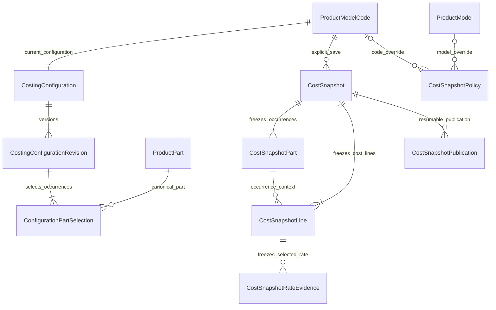

# Parts entity model — deployed Grist schema and remaining gates

Updated costing direction (D070): canonical Parts and rates feed disposable Live Cost; only explicit Save Cost Snapshot freezes Part occurrences, metadata versions, quantities, lines and rate evidence. The old cost-run evidence endpoint now returns 410; new frozen evidence belongs to `CostSnapshotRateEvidence`. Live viewing persists no history. See [live/snapshot requirements and normalized relationships](LIVE_COST_AND_SNAPSHOT_REQUIREMENTS.md) and [visual model](live-cost-snapshot-model.html).

**Status, 8 October 2026:** schema v9 Live Cost/Snapshot base and schema `safari-part-intended-sharing-grist-2026-10-08.v10` are applied to the validated Safari Manufacturing document. Canonical Part business data, explicit Model Code configuration, normalized Cost Snapshots and intended-sharing relationships are Grist-backed. Automatic Summary import/authority integration, CR approval and legacy classification remain later gates. Companion review: `PARTS_IMPLEMENTATION_REVIEW.md`; visual companion: `parts-entity-diagram.html`.

**Cascade update, 8 October 2026:** schema `safari-part-intended-sharing-grist-2026-10-08.v10` is also applied. It adds three normalized intended-sharing tables and `PartRegistryRequest.Payload`; intended sharing and actual configuration usage remain separate. See [implementation and verification record](PART_INTENDED_SHARING_IMPLEMENTATION.md).

## Deployed relationship model

```mermaid
erDiagram
    ProductPart ||--o{ PartMetadataVersion : metadata_history
    ProductPart ||--o{ PartNameAlias : current_and_old_names
    PartMetadataVersion ||--o{ PartNameAlias : generated_name
    PartScopeShortcode ||--o{ PartShortcodeHistory : shortcode_changes
    ProductPart ||--o{ PartRevision : engineering_baselines
    ProductPart ||--o| PartIntendedSharingState : sharing_version
    ProductPart ||--o{ PartIntendedModelCode : advisory_links
    ProductModelCode ||--o{ PartIntendedModelCode : intended_for
    PartIntendedModelCode ||--o{ PartIntendedSharingEvent : immutable_history
    ProductPart ||--o{ PartMappingReview : source_assignments
    PartRevision ||--o{ PartMappingReview : pins_revision
    PartMetadataVersion ||--o{ PartMappingReview : pins_name_metadata
    ProductPart ||--o{ LineMaster : stable_line_owner
    LineMaster ||--o{ LineRevision : versions
    PartRevision ||--o{ PartRevisionLine : exact_process_requirements
    LineRevision ||--o{ PartRevisionLine : pinned_line_revision
    PartRevision ||--o{ PartComponentRevision : parent_definition
    PartRevision ||--o{ PartComponentRevision : child_definition
    PartRevision ||--o{ PartDrawing : optional_revision_drawing
    ProductPart ||--o{ PartPurchaseSpecification : canonical_purchase_identity
    PartRevision ||--o{ PartPurchaseSpecification : specified_revision
    PurchaseItem ||--o{ PartPurchaseSpecification : optional_procurement_catalog
    PartPurchaseSpecification ||--o{ VendorPartMapping : reviewed_vendor_equivalent
    Vendor ||--o{ VendorPartMapping : supplies
    VendorPartMapping ||--o{ PartPurchaseRecord : purchase_evidence
    PartPurchaseRecord ||--o{ PurchasedPartCostEvidence : pinned_selected_purchase
    PartPurchaseSpecification ||--o{ PartPurchaseUnitConversion : approved_uom_basis
    PartPurchaseSpecification ||--o{ PartPurchaseCurrencyConversion : approved_currency_basis
    ProductPart ||--o{ PurchasedPartCostEvidence : costed_identity
    PartRevision ||--o{ PurchasedPartCostEvidence : costed_revision
    Vendor ||--o{ PartPurchaseRecord : transaction_vendor
    PartRegistryCoordinator ||--o{ PartRegistryRequest : single_writer_retries
    CostSnapshotLine ||--o{ CostSnapshotRateEvidence : frozen_rate_provenance
    PartPurchaseRecord o|--o{ CostSnapshotRateEvidence : selected_actual_purchase
    CostingProcessRate o|--o{ CostSnapshotRateEvidence : selected_process_rate
```

`PartComponentRevision` has two references to `PartRevision`: the parent baseline and the pinned child baseline. `PartRevisionLine` references an exact `LineRevision`; line ownership and source observations remain separately stored in `LineMaster`, `LineRevision`, `LineDetail`, `SourceLineObservation` and `SourceLineMapping`. A reviewed source mapping does not itself create configuration usage.

`PartIntendedModelCode` represents advisory code sharing, not a BOM or actual use. Its pair key preserves one row per Part/code across add/remove/re-add; `PartIntendedSharingEvent` is the immutable change history and `PartIntendedSharingState` carries the expected version and membership fingerprint. `ConfigurationPartSelection` remains the separate source of direct actual use.

## Grist tables and current status

| Grist table | Role and implementation status |
| --- | --- |
| `ProductPart` | Existing master extended with stable UUID, permanent `SM-P-######` number, engineering label, typed scope target, generated display fields and current metadata/revision references. Existing legacy rows remain untouched. |
| `PartMetadataVersion` | Append-only generated name, scope, target, shortcode, description, variant and actor/reason/time/request evidence. |
| `PartNameAlias` | Current and historical names with normalized collision key. Previous names remain searchable; retired names remain reserved. |
| `PartIntendedSharingState` | One optimistic-concurrency version and active-membership fingerprint per Part. |
| `PartIntendedModelCode` | Normalized Part/Model Code pair with one deterministic key, active/removed status, pair version and creation/update audit. It is advisory; it never creates a configuration selection. |
| `PartIntendedSharingEvent` | Append-only add/remove evidence with Part, Model Code, batch version, actor, reason, time and durable request fingerprint. |
| `PartScopeShortcode`, `PartShortcodeHistory` | Maintained Global/Product/Product Model/Model Code naming prefixes and audited changes. |
| `PartRevision` | Existing table extended with explicit `RevisionLabel`, baseline status/hash, finalization evidence and request key. Managed baseline is A; legacy numeric `Revision` evidence is not relabelled. Finalized definitions are locked. |
| `PartMappingReview` | Source assignments reference `ProductPart`, stable UUID, exact engineering revision and metadata version/name used, plus workbook/hash/association/group/sheet/row/reviewer/reason/time/retry evidence. |
| `PartComponentRevision` | Parent and child `PartRevision`, positive quantity and UOM, lifecycle/audit and idempotency fields. Cycles are rejected. |
| `PartRevisionLine` | Exact Part baseline to `LineMaster`/`LineRevision`/source observation, process type, quantity per Part and unit. MCL, Toolshop and CNC are optional and mixable. |
| `PartDrawing` | Optional revision-specific file path or external URL, drawing identity, file version/hash and audit. |
| `Vendor`, `PartPurchaseSpecification`, `VendorPartMapping` | Canonical supplier, purchased Part/revision specification, optional `PurchaseItem`, and reviewed SKU equivalence. Multiple vendors can supply the same Part. |
| `PartPurchaseRecord` | Immutable actual transaction evidence: vendor, transaction/date/line, quantity/UOM, currency, extended merchandise amount, discount/charges, status, actor/reason, idempotency, reversal/supersession. |
| `PartPurchaseUnitConversion`, `PartPurchaseCurrencyConversion` | Explicit reviewed/evidenced conversions. Currency evidence is dated. No implicit pack or FX conversion. |
| `PurchasedPartCostEvidence` | Legacy table retained for compatibility; the old write API is HTTP 410. New rate evidence is written to `CostSnapshotRateEvidence` only when a snapshot is explicitly saved. |
| `PartRegistryCoordinator`, `PartRegistryRequest` | One bound writer host and durable request fingerprint/result/retry state in Grist. The SQLite journal only serializes this host and reserves monotonic numbers. |
| `AuditEvent`, `PurchaseItem` | Existing common audit and procurement catalog tables reused; neither is a competing Part master. |

The v9 apply was additive after a native `.grist` backup passed SHA-256 and SQLite integrity checks. It created ten configuration/rate/snapshot/policy/journal tables and added `PartComponentRevision.SourcingRoute`; no type changed. Existing production row counts remained: 1 legacy `ProductPart`, 1 legacy numeric `PartRevision`, 313 `LineMaster`, 0 `PartMappingReview`, 0 `PartRegistryRequest`, 1 `PartRegistryCoordinator`, and 1 workbook `CostingSnapshot`. No production Part, purchase or costing fixture was fabricated. An isolated temporary Grist document verified the new persistence and recovery paths, then was moved to Grist Trash. Backup: `%TEMP%/CostingFilesToGristRemap/safari-grist-backups/safari-manufacturing-live-cost-20261008T063022Z.grist`; SHA-256 `09d732cfe016d0e4a2f61a7886c6b73f581355a5698c51b5d77d8d4e78acea6f`.

The additive v10 apply used a separate native `.grist` backup and added three sharing tables plus `PartRegistryRequest.Payload`; no existing field type changed. Production row counts remained unchanged, including zero rows in the three new sharing tables. No production Part, sharing, purchase or costing fixture was fabricated. v10 backup: `%TEMP%/CostingFilesToGristRemap/safari-grist-backups/safari-manufacturing-bAPdkEDn7brbqTrfVsRmXZ-20261008T073702Z.grist`; SHA-256 `87434603e7376b7c6f0d9bc05a414fa1449bce93438b27dd0d9d06518d017520`.

## Identity, naming and composition rules

- One immutable `StablePartId` and permanent number per physical design. Number allocation is monotonic; gaps and retired numbers are retained.
- Scope selects the generated name prefix and provides a warning context. It does not restrict code usage or automatically configure descendants.
- The creation cascade keeps one Product and optional single Model as filters for multiple intended codes. The separate naming anchor stays Global/Product/Model/Code; selected code shortcodes are never joined into a name. Membership edits do not rename, renumber, revise, reconfigure, remap or snapshot the Part.
- Metadata versions and aliases preserve renamed names without changing the Part UUID, number or engineering A.
- All managed Parts start at A. Rev B+ requires the approved CR workflow, which is not implemented. Existing legacy numeric revisions remain unchanged and unclassified.
- A Part can have any combination of MCL, Toolshop, CNC, child components, drawings or purchase specifications. None is a required exclusive Part type.
- Child references pin child engineering revision and quantity/UOM. A child can be reused by multiple parents. Recursive composition is rejected.
- Exact line revisions and optional drawings are attached to the engineering baseline. Source observation changes cannot silently rewrite a finalized physical definition.
- Mapping saves remain separate from Part creation/selection and do not claim actual per-code usage.
- `Used in configurations` reports direct selections in current published configurations. Indirect/component usage is not expanded and is labelled as such.

## Purchased-Part rate policy

One physically equivalent purchased item has one canonical Part identity regardless of vendor. Only reviewed vendor-SKU mappings can contribute actual purchase records. The resolver in `app/purchased_parts.py` selects by transaction timestamp across all vendors, optionally bounded by an `as_of` time; record-entry order and vendor preference do not decide the rate.

Eligible actuals are posted/completed purchases. Quotes, drafts, voids, returns and reversals are excluded. Repeated transaction lines are idempotent; conflicting duplicates or different rates tied at the latest timestamp block a unique result. Rate basis is net merchandise per costing unit: explicit discount is deducted; tax, freight and other charges are excluded. Unit/currency changes require explicit approved conversion evidence. An incomparable newest eligible record is unavailable/review-needed rather than skipped in favor of an older rate. Missing history is unavailable, not zero. Live rate reads are pure; explicit snapshots store selected purchase evidence in `CostSnapshotRateEvidence`. `PurchasedPartCostEvidence` is retained as a legacy table and receives no new records through the deprecated HTTP 410 API.

This does not change the existing `MaterialRateLog` behavior (latest entered matching row, otherwise Default Material rate). Purchased-Part actual purchase history remains separate from Material pricing.

## Implemented costing and remaining gates

`CostingConfiguration` → `CostingConfigurationRevision` → `ConfigurationPartSelection` is implemented as explicit per-Model-Code usage; broad scope and source mapping are never inferred as a BOM. Disposable Live Cost consumes explicit configurations, manufacturing requirements, purchased specifications and sourced process rates. Only explicit Save writes normalized `CostSnapshot`, `CostSnapshotPart`, `CostSnapshotLine` and `CostSnapshotRateEvidence` rows; history verifies its checksum and reads frozen data only. `CostSnapshotPolicy` implements inherited reminders, not automatic saves. Automatic Summary extraction/authority integration remains deferred, as do CR approval and reviewed classification/migration of legacy Part identities/numeric revisions. These gates do not imply costing completion or authority cutover.

## Live Cost and Cost Snapshot relationships (D070)

Schema definitions are in `app/schema.py`. Snapshot rows store scalar frozen values alongside canonical references. `CostSnapshotPublication` holds retry state, not a serialized calculation blob. A direct edit by an authorized Grist table writer is outside application immutability controls; the application detects altered normalized rows through the saved checksum and refuses the historical read.
