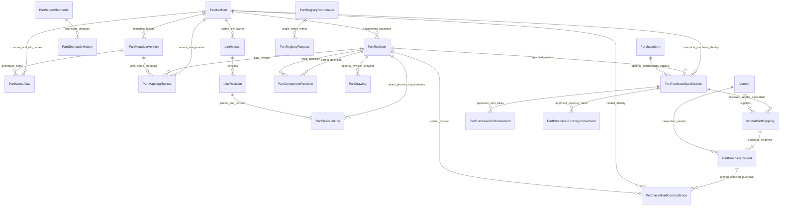

# Parts entity model — deployed Grist schema and remaining gates

**Status, 7 October 2026:** schema `safari-parts-grist-2026-10-07.v8` is applied to the validated Safari Manufacturing document. Canonical Part business data is Grist-backed. This diagram distinguishes deployed Parts records from future per-code configuration. Companion review: `PARTS_IMPLEMENTATION_REVIEW.md`; visual companion: `parts-entity-diagram.html`.

## Deployed relationship model

`PartComponentRevision` has two references to `PartRevision`: the parent baseline and the pinned child baseline. `PartRevisionLine` references an exact `LineRevision`; line ownership and source observations remain separately stored in `LineMaster`, `LineRevision`, `LineDetail`, `SourceLineObservation` and `SourceLineMapping`. A reviewed source mapping does not itself create configuration usage.

## Grist tables and current status

| Grist table | Role and implementation status |
| --- | --- |
| `ProductPart` | Existing master extended with stable UUID, permanent `SM-P-######` number, engineering label, typed scope target, generated display fields and current metadata/revision references. Existing legacy rows remain untouched. |
| `PartMetadataVersion` | Append-only generated name, scope, target, shortcode, description, variant and actor/reason/time/request evidence. |
| `PartNameAlias` | Current and historical names with normalized collision key. Previous names remain searchable; retired names remain reserved. |
| `PartScopeShortcode`, `PartShortcodeHistory` | Maintained Global/Product/Product Model/Model Code naming prefixes and audited changes. |
| `PartRevision` | Existing table extended with explicit `RevisionLabel`, baseline status/hash, finalization evidence and request key. Managed baseline is A; legacy numeric `Revision` evidence is not relabelled. Finalized definitions are locked. |
| `PartMappingReview` | Source assignments reference `ProductPart`, stable UUID, exact engineering revision and metadata version/name used, plus workbook/hash/association/group/sheet/row/reviewer/reason/time/retry evidence. |
| `PartComponentRevision` | Parent and child `PartRevision`, positive quantity and UOM, lifecycle/audit and idempotency fields. Cycles are rejected. |
| `PartRevisionLine` | Exact Part baseline to `LineMaster`/`LineRevision`/source observation, process type, quantity per Part and unit. MCL, Toolshop and CNC are optional and mixable. |
| `PartDrawing` | Optional revision-specific file path or external URL, drawing identity, file version/hash and audit. |
| `Vendor`, `PartPurchaseSpecification`, `VendorPartMapping` | Canonical supplier, purchased Part/revision specification, optional `PurchaseItem`, and reviewed SKU equivalence. Multiple vendors can supply the same Part. |
| `PartPurchaseRecord` | Immutable actual transaction evidence: vendor, transaction/date/line, quantity/UOM, currency, extended merchandise amount, discount/charges, status, actor/reason, idempotency, reversal/supersession. |
| `PartPurchaseUnitConversion`, `PartPurchaseCurrencyConversion` | Explicit reviewed/evidenced conversions. Currency evidence is dated. No implicit pack or FX conversion. |
| `PurchasedPartCostEvidence` | Persists the as-of selection, purchase/vendor/specification/revision, normalized quantity/UOM/currency, base price, discount, applied rate and calculation status against supplied cost-run/configuration keys. |
| `PartRegistryCoordinator`, `PartRegistryRequest` | One bound writer host and durable request fingerprint/result/retry state in Grist. The SQLite journal only serializes this host and reserves monotonic numbers. |
| `AuditEvent`, `PurchaseItem` | Existing common audit and procurement catalog tables reused; neither is a competing Part master. |

The v8 apply was additive after a native `.grist` backup passed SHA-256 and SQLite integrity checks. The production Safari document currently reads: 1 legacy `ProductPart`, 1 legacy numeric `PartRevision`, 313 `LineMaster`, 0 `PartMappingReview`, 0 managed Part/purchase fixture rows, and 1 `PartRegistryCoordinator`. No production Part or purchase business fixture was fabricated. An isolated temporary Grist document verified writes/read-back and restart; synthetic data was not transferred to production and the test document was moved to Grist Trash.

## Identity, naming and composition rules

- One immutable `StablePartId` and permanent number per physical design. Number allocation is monotonic; gaps and retired numbers are retained.
- Scope selects the generated name prefix and provides a warning context. It does not restrict code usage or automatically configure descendants.
- Metadata versions and aliases preserve renamed names without changing the Part UUID, number or engineering A.
- All managed Parts start at A. Rev B+ requires the approved CR workflow, which is not implemented. Existing legacy numeric revisions remain unchanged and unclassified.
- A Part can have any combination of MCL, Toolshop, CNC, child components, drawings or purchase specifications. None is a required exclusive Part type.
- Child references pin child engineering revision and quantity/UOM. A child can be reused by multiple parents. Recursive composition is rejected.
- Exact line revisions and optional drawings are attached to the engineering baseline. Source observation changes cannot silently rewrite a finalized physical definition.
- Mapping saves remain separate from Part creation/selection and do not claim actual per-code usage.

## Purchased-Part rate policy

One physically equivalent purchased item has one canonical Part identity regardless of vendor. Only reviewed vendor-SKU mappings can contribute actual purchase records. The resolver in `app/purchased_parts.py` selects by transaction timestamp across all vendors, optionally bounded by an `as_of` time; record-entry order and vendor preference do not decide the rate.

Eligible actuals are posted/completed purchases. Quotes, drafts, voids, returns and reversals are excluded. Repeated transaction lines are idempotent; conflicting duplicates or different rates tied at the latest timestamp block a unique result. Rate basis is net merchandise per costing unit: explicit discount is deducted; tax, freight and other charges are excluded. Unit/currency changes require explicit approved conversion evidence. An incomparable newest eligible record is unavailable/review-needed rather than skipped in favor of an older rate. Missing history is unavailable, not zero. Historical costing must retain the selected `PurchasedPartCostEvidence`; later purchases do not alter earlier evidence.

This does not change the existing `MaterialRateLog` behavior (latest entered matching row, otherwise Default Material rate). Purchased-Part actual purchase history remains separate from Material pricing.

## Deferred work

`CostingConfiguration` → `CostingConfigurationRevision` → `ConfigurationPartSelection` remains the explicit future model for actual Model Code usage and is not implemented by this Part slice. Automatic Summary extraction and full cost-run integration are also deferred; the shared resolver, Part detail display and cost-evidence persistence interface exist, but the current costing engine does not consume purchased-Part selections end to end. The CR approval workflow and reviewed classification/migration of legacy Part identities and numeric revisions are not implemented. These limitations are shown in `Used in` and the API/UI and do not imply costing completion or authority cutover.
